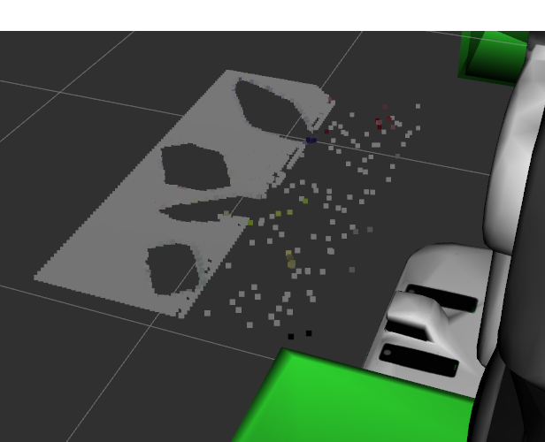
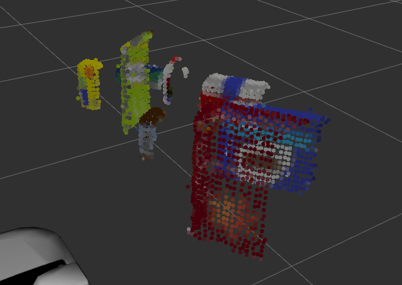
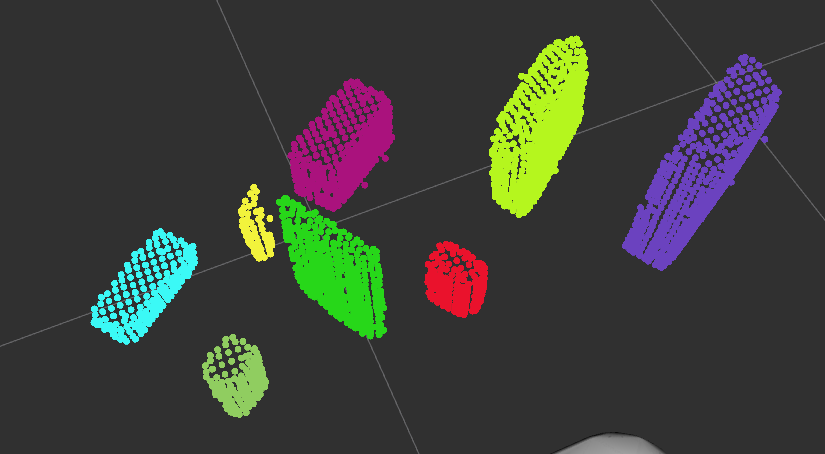
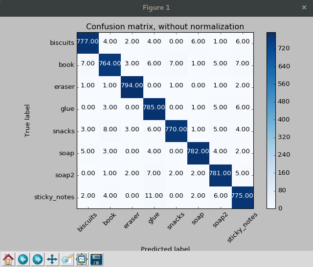
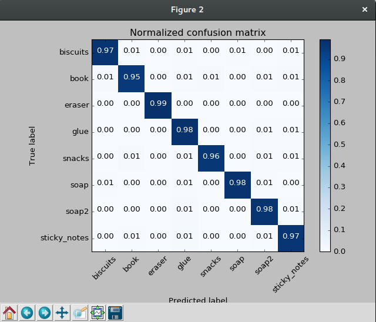
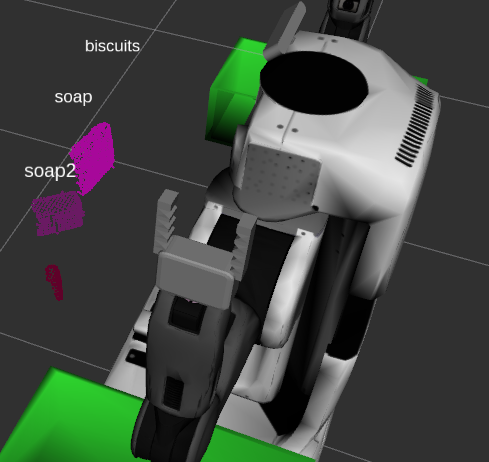
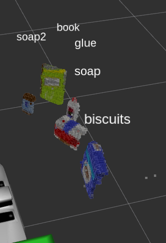
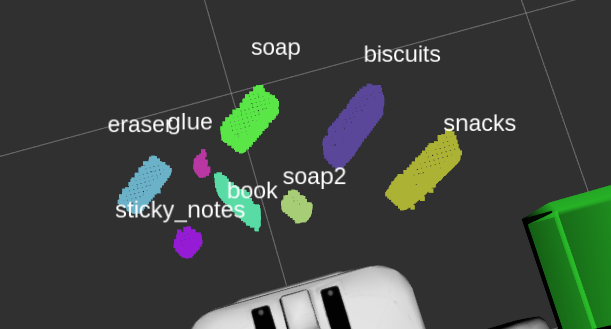

# Pick and Place Perception Writeup
#### This project was a great way to explore the systematic process robots take to make inferences about their environment. The project utilized a RGB-D(Depth) camera on Pr2(Personal Robot) and my goal was to create a pipeline for processing point cloud data and returning `output_*.yaml` indicating the position of the objects form their respective world `pick_list_*.yaml`.  


### Exercise 1, 2 and 3 pipeline implemented
#### Pipeline for filtering: 

```Python
   # statistical outlier filtering
    outlier_filter  = cloud.make_statistical_outlier_filter()

    outlier_filter.set_mean_k(20)
    
    x=0.1
    outlier_filter.set_std_dev_mul_thresh(x)
    cloud_filtered = outlier_filter.filter()
    # Voxel Grid Downsampling
    vox = cloud_filtered.make_voxel_grid_filter()
    LEAF_SIZE = .01
    #set voxel size
    vox.set_leaf_size(LEAF_SIZE, LEAF_SIZE, LEAF_SIZE)
    cloud_filtered = vox.filter()
```

#### RANSAC plane fitting implemented:
I used Random Sample Consensus algorithm to find a plane that identified the table. Using the flags I created `Cloud_table` and `Cloud_object` which I later published and visualized in RViz.

```python
    # RANSAC Plane Segmentation
    seg = cloud_filtered.make_segmenter()
    seg.set_model_type(pcl.SACMODEL_PLANE)
    seg.set_method_type(pcl.SAC_RANSAC)
    max_distance = 0.01
    seg.set_distance_threshold(max_distance)
    inliers, coefficients = seg.segment()
    # Extract inliers and outliers
    cloud_table = cloud_filtered.extract(inliers, negative=False)
    cloud_objects = cloud_filtered.extract(inliers, negative=True)
```
### Here we have the cloud_table:

### Here we have the cloud_object:

#### Pipeline including clustering for segmentation implemented.  

##### Next I was able to implement euclidean clustering technique to create clusters that were close enough to each-other to start identifying objects. I had to adjust the MinClusterSize to be able to find the bottle of glue in the the third test case. MinClusterSize varied between 20 and 100.

```python
# Euclidean Clustering
    white_cloud = XYZRGB_to_XYZ(cloud_objects)
    tree = white_cloud.make_kdtree()
    # Create cluster extraction object
    ec = white_cloud.make_EuclideanClusterExtraction()
    # Set tolerances for distance threshold
    # as well as minimum and maximum cluster size (in points)
    ec.set_ClusterTolerance(0.02)
    ec.set_MinClusterSize(20)
    ec.set_MaxClusterSize(2700)
    # Search the k-d tree for clusters
    ec.set_SearchMethod(tree)
    # Extract indices for each of the discovered clusters
    cluster_indices = ec.Extract()

    # Create Cluster-Mask Point Cloud to visualize each cluster separately
    #Assign a color corresponding to each segmented object in scene
    cluster_color = get_color_list(len(cluster_indices))
```




####  Features extracted and SVM trained.  Object recognition implemented.
This section included two major steps: data gathering and analysis. I was able to use the sensor stick to collect point clouds of each object and capture features to later normalize and compare with base case and represent in the confusion matrix. I set the feature extraction to find 800 iterations of the each object which in retrospect was over-kill. There are still some aspects which I don't understand about the format of the sav files which I hope to explore in the future. I was able to feed the `train_set_project.sav` file to the `train_svm_project.py` script which produced the `model.sav`
used in the `project.py`.







### Pick and Place Setup

#### For all three tabletop setups (`test*.world`), perform object recognition, then read in respective pick list (`pick_list_*.yaml`). Next construct the messages that would comprise a valid `PickPlace` request output them to `.yaml` format.
```python
 Get centroid 
            centroid_array = np.mean(ros_to_pcl(val.cloud).to_array(), axis=0)[0:3]
            centroid = [np.asscalar(x) for x in centroid_array]

            # Create 'place_pose' for the object
            ros_object_name = String()
            ros_object_name.data = object_name
            ros_pick_pos = Pose()
            ros_pick_pos.position.x = centroid[0]
            ros_pick_pos.position.y = centroid[1]
            ros_pick_pos.position.z = centroid[2]
```
Here is an image of the clustering and labeling for world one 


Here is an image of world two



And finally I was able to even get the little glue guy hiding behind the book.

## Project discussion and future challenges
 It took me a while to understand all the different components of this project. I found it challenging to complete, I was able to finally get my code to run natively. Most of the challenges I faced were with not know which parts of the project I need to do in which order. Going back to the lessons I was finally able to get a proper road map. I would also like to thank everyone in the slack community for all their help and support throughout the different bugs I encountered and possibly mad in my own code.
I did come across a few errors that may have been caused by my GCC compiler on my local installation of Ubuntu. I had to wrap the bool values in some of the CPP code as `static_cast<bool>(left_gripper_group.move());` 
Excited to move ahead with the future projects.

In the future I would like to continue on the rest of the project by actually implementing the code needed to pick up and place the objects.

